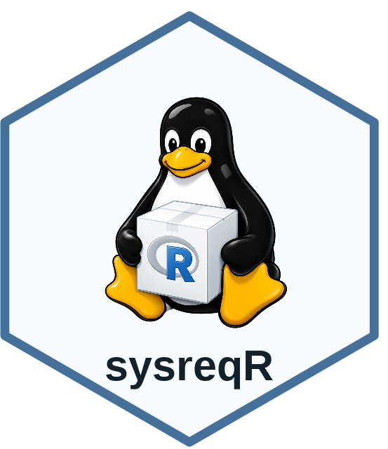

# sysreqR 

<!-- badges: start -->
[](https://CRAN.R-project.org/package=sysreqr)
[](https://github.com/choxos/sysreqR/actions/workflows/R-CMD-check.yaml)
[](https://app.codecov.io/gh/choxos/sysreqR)
[](https://lifecycle.r-lib.org/articles/stages.html#experimental)
[](https://www.gnu.org/licenses/gpl-3.0)
<!-- badges: end -->

`sysreqr` helps R users on GNU/Linux find the system packages they need
before, or after, an R package installation fails. It runs offline by default,
generates portable shell, Docker, and CI commands, and never edits operating
system state itself; the user stays in control.

It can:

* check system requirements for R packages, projects, and installed libraries;
* generate install commands, shell scripts, Dockerfile snippets, and GitHub
  Actions snippets;
* diagnose common failed-install logs;
* suggest beginner-friendly setup steps for Linux R installations;
* prepare a concise administrator request when the user cannot run `sudo`.

`sysreqr` has **zero runtime dependencies**. The `Suggests` field lists only
`testthat`, `knitr`, `rmarkdown`, and `withr`, which are used for tests and
vignette building; none of them are loaded when a user calls package
functions.

## Installation

After release on CRAN:

```r
install.packages("sysreqr")
```

Development version:

```r
# install.packages("pak")
pak::pak("choxos/sysreqR")
```

`pak` is used here only as an installer. It is **not** a dependency of
`sysreqr`.

The development version does not build the vignettes by default. Read them on
the [package website](https://choxos.github.io/sysreqR/articles/), or build
them locally with:

```r
# install.packages("remotes")
remotes::install_github("choxos/sysreqR", build_vignettes = TRUE)
```

## Quick start

```r
library(sysreqr)

plan <- check_packages(
  c("xml2", "curl"),
  platform = "ubuntu-22.04"
)

plan
#> System requirement preflight
#>
#> Platform: Ubuntu 22.04
#> Package manager: apt
#> Backend: bundled
#>
#> R packages checked:
#>   xml2, curl
#>
#> System packages to install:
#>   libcurl4-openssl-dev  needed by: curl  status: unknown
#>   libssl-dev            needed by: curl  status: unknown
#>   libxml2-dev           needed by: xml2  status: unknown
#>
#> Run:
#>   sudo apt-get update
#>   sudo apt-get install -y libcurl4-openssl-dev libssl-dev libxml2-dev
```

Turn the plan into install commands:

```r
install_command(plan)
write_install_script(plan, file.path(tempdir(), "install-sysreqs.sh"))
```

Or into a deployment snippet:

```r
dockerfile(plan)
github_actions(plan)
```

Or into an administrator request:

```r
admin_request(plan)
```

## Setup advice for new Linux users

```r
setup_advice(platform = "ubuntu-24.04")
```

For package-specific setup advice and a reviewable shell script:

```r
setup_advice(
  packages = c("xml2", "curl"),
  platform = "ubuntu-24.04",
  script = file.path(tempdir(), "setup-sysreqr.sh")
)
```

`setup_advice()` prints a practical four-layer checklist (binary packages,
build tools, optional R Project repositories, package-specific requirements)
and writes a shell script **only** when `script` is supplied. It never runs
`sudo`, edits `.Rprofile`, or changes operating system repository files.

## Diagnose failed installations

After a failed install in the current R session:

```r
check_error(platform = "ubuntu-22.04")
```

From a log file:

```r
diagnose_log("install.log", platform = "ubuntu-22.04")
```

If the failed package names are already known:

```r
diagnose_failed_packages(
  c("xml2", "curl"),
  platform = "ubuntu-22.04"
)
```

Diagnosis returns a regular `sysreqr_plan`, so the result feeds straight into
`install_command()`, `write_install_script()`, `admin_request()`,
`dockerfile()`, or `github_actions()`.

## Projects and libraries

Check a project directory (reads `renv.lock`, then `DESCRIPTION`, then source
files):

```r
check_project(".")
```

Check installed packages:

```r
check_library()
check_library(c("xml2", "curl"))
```

## Posit Package Manager

Build a Linux binary repository URL:

```r
ppm_repo(platform = "ubuntu-24.04")
#> [1] "https://packagemanager.posit.co/cran/__linux__/noble/latest"
```

Preview the `.Rprofile` lines that would point R at it:

```r
use_ppm(platform = "ubuntu-24.04", dry_run = TRUE)
```

Query live system requirement data when network access is available:

```r
ppm_sysreqs(
  packages = c("xml2", "curl"),
  platform = "ubuntu-22.04"
)
```

## Vignettes

The package ships five focused vignettes:

```r
vignette("preflight-setup",      package = "sysreqr")
vignette("diagnosing-failures",  package = "sysreqr")
vignette("linux-fundamentals",   package = "sysreqr")  # for GNU/Linux newcomers
vignette("docker-and-ci",        package = "sysreqr")
vignette("faq",                  package = "sysreqr")
```

If you installed the development version without vignettes, read them on the
[package website](https://choxos.github.io/sysreqR/articles/).

## Supported platforms

`sysreqr` focuses on GNU/Linux. Detection and platform-specific commands are
tested for:

* **Ubuntu**: 22.04 (`jammy`), 24.04 (`noble`), 26.04 (`resolute`)
* **Debian**: 12 (`bookworm`), 13 (`trixie`)
* **Red Hat Enterprise Linux** and binary-compatible rebuilds (Rocky Linux,
  AlmaLinux): 8, 9, 10
* **Fedora**: current releases
* **CentOS** 7 (legacy)
* **openSUSE Leap** / **SUSE Linux Enterprise**: 15.6
* **Alpine**: 3.20

macOS and Windows are detected, but most package installation problems on
those platforms are handled by CRAN binaries rather than system package
checks.

## Comparison with related tools

| Tool                              | Strengths                                          | Limitations                              |
|-----------------------------------|----------------------------------------------------|------------------------------------------|
| `pak::pkg_sysreqs()`              | Authoritative live resolver                        | Requires `pak`; no log diagnosis         |
| `remotes::system_requirements()`  | Light; widely available                            | No log diagnosis, no project scanner     |
| `renv::sysreqs()`                 | Project-oriented; integrates with `renv` workflow  | Requires `renv`                          |
| `sysreqr`                         | Zero runtime deps; log diagnosis; beginner UX      | Bundled DB is small; biased toward `apt` |

`sysreqr` can use `pak` as one of its backends (`backend = "pak"`) when it
is installed. The tools are complementary, not competitors.

## Limitations

System requirement data can be incomplete when upstream metadata is
incomplete. Binary packages avoid most source compilation problems, but they
do not solve every runtime library, R version, permission, or network issue.

Log diagnosis is heuristic. It reports likely fixes, not guarantees.

## Citation

Sofi-Mahmudi, A. (2026). *sysreqr: Preflight Checks for R Package System
Requirements*. R package. <https://github.com/choxos/sysreqR>.

ORCID: <https://orcid.org/0000-0001-6829-0823>.

## Acknowledgments

Portions of the package code, documentation, and tests were drafted and
audited with the assistance of large language models: Anthropic's Claude
Opus 4.7 Max (via [Claude Code](https://claude.com/product/claude-code))
and OpenAI's ChatGPT 5.5 xhigh (via [Codex](https://openai.com/codex/)).
All design decisions and the final review and validation were performed
by the named author, who takes responsibility for the package's contents.

## License

GPL-3. See <https://www.gnu.org/licenses/gpl-3.0> for the full license text.
